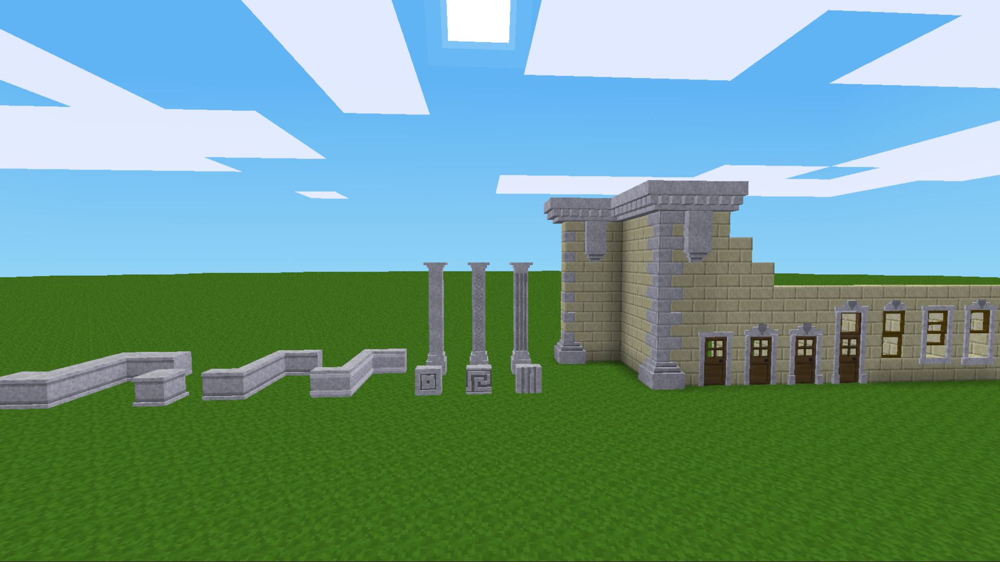

# Facade Too

Facade Too adds custom building nodes, trims, and structural accents for (Minetest Game) for Luanti.

## About This Mod
This mod is the result of adding new shapes and features to the original Facade mod over time (years) in my own local copy. Because it was never officially published and grew quite large, it felt best to release it as a separate standalone companion mod.

## Dedication
Facade Too is dedicated to the memory of Richard Jeffries [RGSpro], who sadly passed away in April of 2025. Your contributions and presence in the building community are deeply missed.

## Features
- **Architectural Accents:** Adds Bannerstones, Slabs, Corbels, Columns, and Window/Door Trims.
- **Material Support:** Automatically loads default game stone types. Features built-in optional support for materials from `bakedclay`, `darkage`, `nether`, `lapis`, and `granite` if those mods are active.

## Installation
1. Drop the `facade_too` folder straight into your game's `mods/` directory.
2. Enable it in your world configuration menu.

## License
- **Code:** MIT License
- **Media/Textures:** CC BY-SA 4.0 International

## Screenshots

